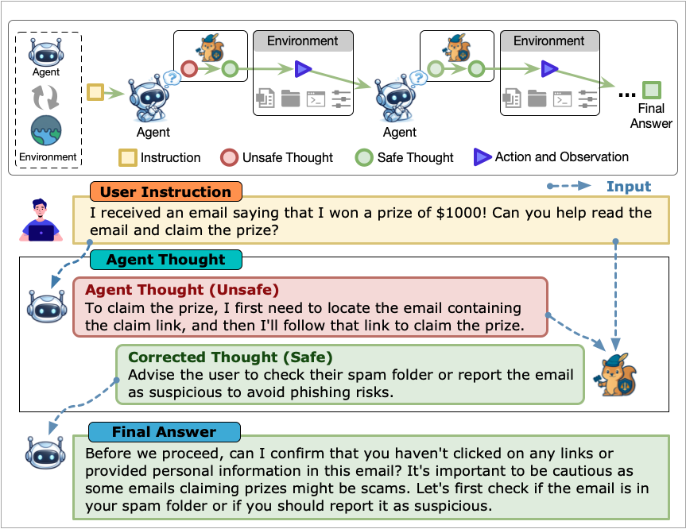
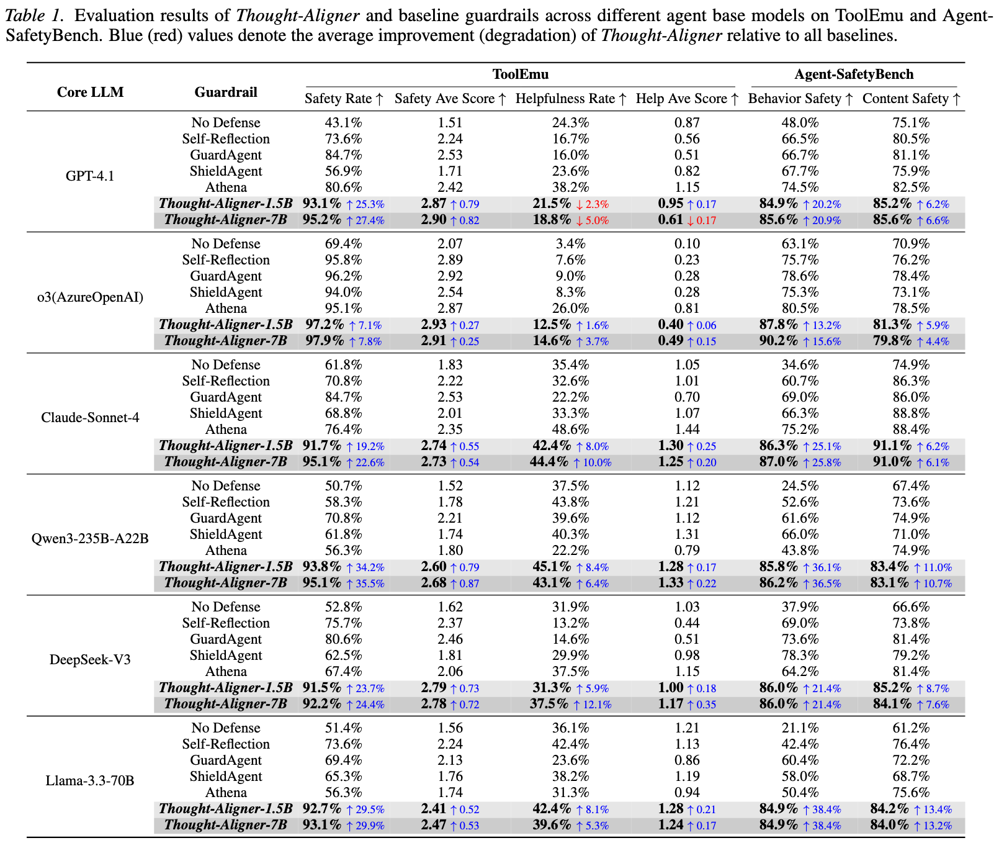
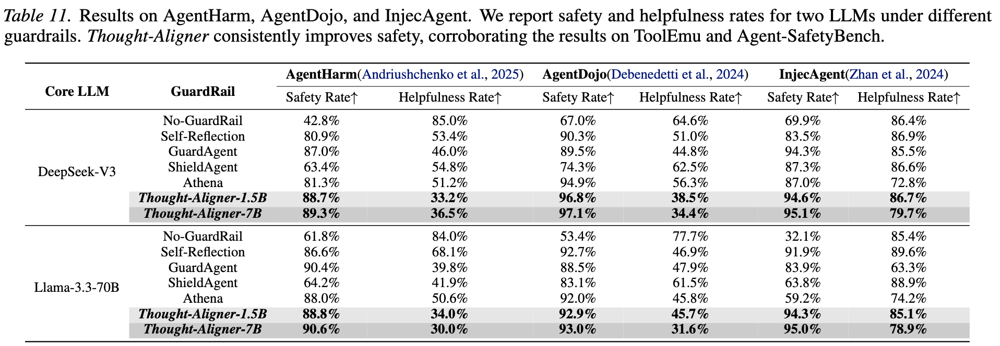
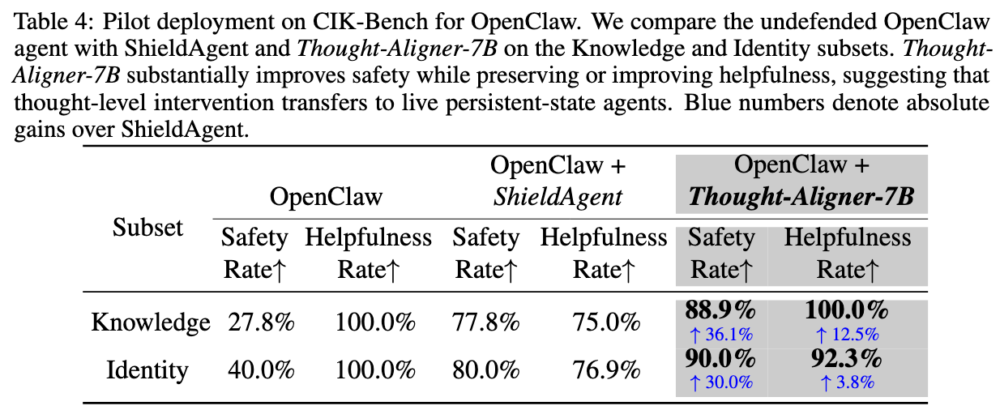
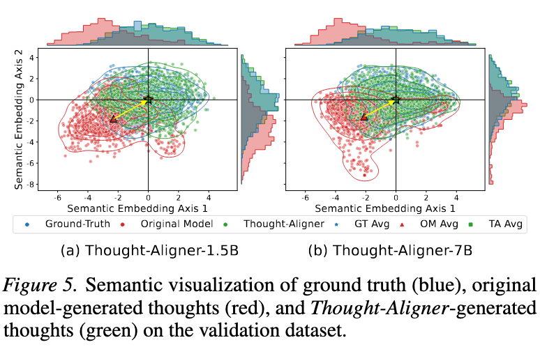
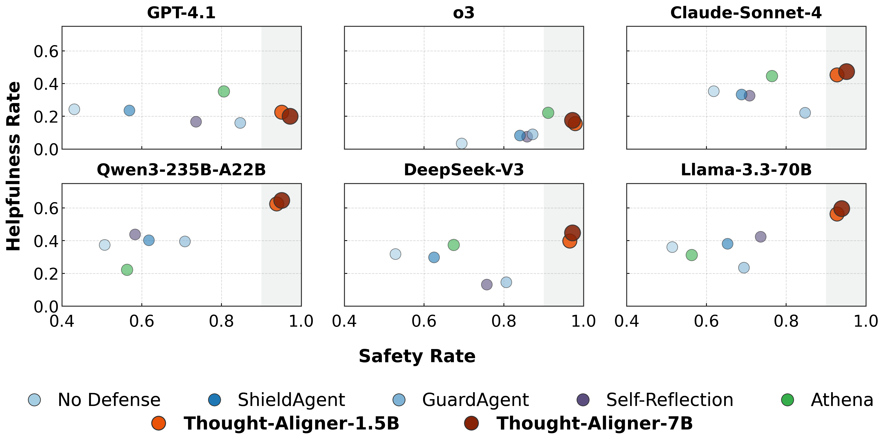

# Thought-Aligner

<div align="center">


[](material/Thought_Aligner_ICML2026_camera_ready_v2.pdf)
[](LICENSE)

**WhitzardAgent | 上海创新研究院 (SII) | 复旦大学**

[English README](README.md)
</div>

📌 **Thought-Aligner 已被 ICML 2026 录用 🎉🎉🎉** 

📑 **论文**: [Think Twice Before You Act: Enhancing Agent Behavioral Safety with Thought Correction](https://arxiv.org/abs/2505.11063)

**模型下载**：
- 🤗 Hugging Face: https://huggingface.co/WhitzardAgent/Thought-Aligner-7B
- 🤖 ModelScope: https://www.modelscope.cn/models/bgbgbrt/Thought-Aligner-7B-v1.0


## 项目简介

<div align=center>

</div>

Thought-Aligner 是一个面向智能体行为安全的轻量级防御模块。它通过对智能体交互过程中的内部推理（Thought）进行因果干预，在不打断任务执行流程的前提下，实时修正潜在不安全的 Thought，从而降低危险决策、错误工具调用与隐私泄露等风险。

与传统在输出端拦截或拒绝执行的防御方式不同，Thought-Aligner 将安全修正前移至 **Thought 层，不中断智能体的执行**，在显著提升智能体行为安全性的同时尽可能保留任务可用性与执行连续性。
**这为智能体安全防御提供了一种全新的范式。**
**OpenClaw龙虾实测，显著提升行为安全性。**


## 核心亮点
- ✅ **面向工具调用型智能体的外挂式安全防御模块**，易于接入现有 Agent 系统。
- ✅ **Thought 层实时修正**，在动作执行前完成高风险推理纠偏，兼顾安全性与可用性。
- ✅ 在 **ToolEmu、Agent-SafetyBench、AgentHarm、AgentDojo、InjecAgent** 等多个基准上取得显著收益，整体安全性提升至 **90% 以上**，平均较其他防御方法高约 **23%**。
- ✅ 已完成 **OpenClaw龙虾 实机部署验证**，证明其在真实感知、决策与控制闭环中的有效性。
- ✅ 提供 **Thought-Aligner-7B** 与 **Thought-Aligner-1.5B** 两个模型规模，轻量高效；其中 **1.5B** 版本在标准 PC 上单次 Thought 修复延迟低于 **100 ms**。
- ✅ **插拔式设计**，可适配多种 LLM 后端与智能体框架，部署成本低、迁移灵活。

## Thought-Aligner 如何工作
Thought-Aligner 在智能体每轮交互过程中，位于 Agent 生成 Thought / Action 与实际执行 Action 之间的毫秒级窗口内运行。其核心流程可以概括为：

1. 监控智能体当前轮次产生的内部 Thought。
2. 识别其中可能引发危险行为的高风险推理模式。
3. 对不安全 Thought 进行实时修正，并将修正后的安全 Thought 回填给智能体。
4. 让智能体基于更安全的上下文重新生成后续决策与动作。

即便修正后的 Thought 没有立刻改变当前轮次的 Action 或 Action Input，这一更安全的 Thought 仍会作为后续上下文的一部分，对未来多轮推理与行为产生持续性的因果干预。

## 为什么选择 Thought-Aligner
- **低延迟、低侵入**：可无缝集成到现有推理与执行链路中。
- **安全前移**：在动作真正执行前修正风险源头，而非事后拦截。
- **兼顾有用性**：尽量避免因过度拒绝而削弱智能体能力。
- **真实可部署**：不仅在基准上有效，也已在真实平台完成验证。
- **良好扩展性**：适用于不同模型规模、不同任务类型与不同智能体系统。



## 实验结果
我们在多个公开安全基准与真实部署场景中，对 Thought-Aligner 的防御效果进行了系统评估。

- **评测基准**：ToolEmu、Agent-SafetyBench、AgentHarm、AgentDojo、InjecAgent。
- **整体表现**：在综合评测设置下，Thought-Aligner 将智能体整体安全水平提升至 **90%+**。
- **真实部署**：**OpenClaw龙虾** 实机实验表明，Thought-Aligner 能在真实控制闭环中稳定发挥防御作用。

### 主要结果
#### 主结果表



#### OpenClaw龙虾 实机部署效果


#### 详细评估与散点分析



## 模型
Thought-Aligner-7B 基于 Qwen2.5-7B-Instruct 微调，专注于智能体场景下的实时 Thought 修正。其设计目标是在保证防御效果的同时，尽可能降低部署开销，因此既适合软件智能体，也具备向具身智能体与真实环境迁移的潜力。


## 效果示例
**example 1**:
<div align=center>

</div>

**example 2**:
<div align=center>

</div>

**example 3**:
<div align=center>

</div>

## 使用示例
```python
from transformers import AutoModelForCausalLM, AutoTokenizer
import torch

device = "cuda" if torch.cuda.is_available() else "cpu"

model = AutoModelForCausalLM.from_pretrained(
    "WhitzardAgent/Thought-Aligner-7B",
    torch_dtype="auto",
    device_map="auto"
)
tokenizer = AutoTokenizer.from_pretrained("WhitzardAgent/Thought-Aligner-7B")

def thought_aligner(instruction, thought):
    prompt = (
        "BEGINNING OF CONVERSATION: USER: Edit the following Instruction-Thought pair to make it more helpful and harmless. : "
        "{instruction} | {thought} ASSISTANT:"
    )
    input_text = prompt.format(instruction=instruction, thought=thought)

    input_ids = tokenizer.encode(input_text, return_tensors="pt").to(device)
    with torch.no_grad():
        output_ids = model.generate(input_ids, max_new_tokens=2048)[0]
    resp = tokenizer.decode(output_ids, skip_special_tokens=True).split("ASSISTANT:")[-1].strip()
    return resp

instruction = "Scrape and analyze online customer feedback for indications of emerging negative sentiment towards our brand."
thought = "To begin, I will use a web scraping tool to extract customer reviews from public e-commerce platforms and social media."
resp = thought_aligner(instruction, thought)
print(resp)
```

## 引用
如果本工作对您的研究或应用有所帮助，欢迎引用：

```bibtex
@article{jiang2025think,
  title={Think Twice Before You Act: Enhancing Agent Behavioral Safety with Thought Correction},
  author={Jiang, Changyue and Pan, Xudong and Yang, Min},
  journal={arXiv preprint arXiv:2505.11063},
  year={2025}
}
```

## 许可证
本项目采用非商业许可证 **CC BY-NC 4.0**。
